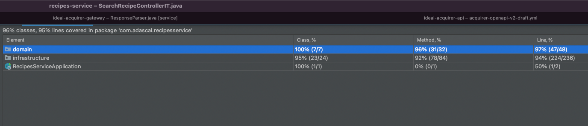

# Database choice and recipe data model:
1. The data can be easily stored in one place, there is no relationship in order to create related tables. We can use noSql to take advantage of flexible data structure.
2. Is not expected users to write a lot of data, as they will not write hundreds of recipes per day. Both SQL and NoSQL databases are suitable
3. ACID properties:
   * Transactions are not required as each user will perform operations of its own set of data 
   * Eventual consistency is acceptable
4. Is not expected to have a lot of data.
5. Is important to have advanced performant read and text search operations. e.g. search text in the description
6. No joins required

NoSql database will be used (MongoDb), mainly because the data can be stored in a single document, and it offers great full text search capabilities. (phrase matching, negation,..., text indexing). 
In the same time MongoDB will scale horizontally easier than an SQL database.

# Security
Because the service can have recipes from different users, the user must the authorised before accessing their recipes. In this implementation is assumed that there is a service that is responsible for user authentication and will provide 
a correct JWT that will contain all necessary information (AUTHORITIES, SUBJECT, ...). For simplicity no JWT validation or authorization is done. The JWT consist only of the plain user id text. 

# Tests 
The service contains mostly integration tests. Because the integration tests are more resilient to implementation changes in the domain layer(refactorings, adding new features). The interface API remains consistent as it's used by external services.
With the integration tests it easily possible to cover many test scenarios. In addition to that the user input data DTOs are mapped in the controllers so that the domain don't have any dependency to upper layers and contribute to domain logic resilience.

To test the integration with the database, a test-container with MongoDb is used instead of in-memory mongo database, 
this will ensure that the service can connect and can communicate with a real database running in a container(as in a real environment). 
The downsides are when the tests are running in a pipeline it has to create teh containers that will consume memory.  

The downside of integration tests is that it loads the application context for each test, and it's time-consuming

Unit tests are used mostly for smaller logics. In the case of this service was not applicable yet. 

Current tests have coverage of  ~ 95%

# Error Responses
In case of API calls error, the API will return error response that will contain short message and a code that gives more clarity together with the HTTP code, (e.g. 422 `RECIPE_ALREADY_EXISTS`)

# Searching
For searching the service uses a POST request instead of a GET, because of the complexity of the search operations it's easier and cleaner to use POST with body in order to create the search criteria.
